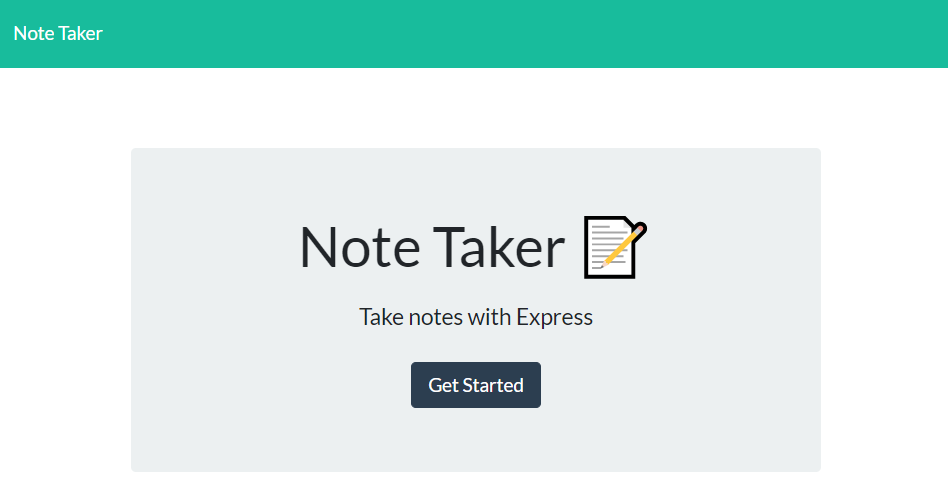
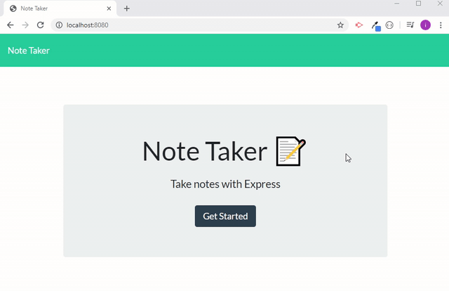

# Note-Taker
A simple note taking aplication that leverages the express nmp package of node.js to track our notes and provide data persistence.

## Table of Contents
1. Introduction
2. Technologies Used
3. Requirements
4. Code Examples
5. The App in Action!
6. Authors
7. Acknowledgements

## Introduction
This application makes it easy to keep track of various notes using node.js, the express npm package, and the browser. The user is easly able to create and save new notes, as well as they can delete old ones.

## Technologies Used
* HTML
* CSS
* JavaScript
* Node.js
* Express (npm package)

## Requirements
* Node.js with the express package installed
* Browser

## Code Examples
Below are some examples of this applications use of get, post, and delete requests to manipulate the database where note information is stored.

    // ===========================================================
    // LOAD DATA
    // ===========================================================
    var fs = require("fs");

In order to dynamically update our database file, we need to use the file system (fs) node preset.

    // ===========================================================
    // ROUTING
    // ===========================================================

    module.exports = function(app) {
        var notes;

Exporting the following functions allows them to be used by our server.js file when the application is run.

        // ===========================================================
        // GET REQUESTS
        // ===========================================================
        app.get("/api/notes", function(req, res) {
            // THIS READS OUR db.json FILE...
            fs.readFile("./db/db.json", function(err, data) {
                if (err) throw err;
                // ... AND OFFERS THE PARSED DATA AS THE RESPONSE
                res.json(JSON.parse(data))
            })
        });

This get requests shows the user all of their saved notes as well as a space to write new notes.

        // ===========================================================
        // POST REQUESTS
        // ===========================================================
        app.post("/api/notes", function(req, res) {
            var newNote = req.body;
            // FIRST WE READ OUR db.json AND PARSE IT INTO AN OBJECT
            fs.readFile("./db/db.json", function(err, data) {
                if (err) throw err;
                var notes = JSON.parse(data);
                // THIS ALLOWS US TO PUSH THE REQUEST BODY OBJECT INTO OUR db.json AS A NEW NOTE
                notes.push(newNote);
                // THIS CREATES UNIQUE IDS FOR EACH OF OUR NOTES, THIS WILL COME IN HANDY LATER
                notes.forEach( function(item, i) {
                    item.id = 1 + i;
                })
                // ONCE OUR NEW NOTE HAS BEEN ADDED, WE REVERT OUR notes OBJECT BACK TO A STRING AND REWRITE IT TO THE RESPECTIVE FILE FOR LATER USE
                fs.writeFile("./db/db.json", JSON.stringify(notes), function(err) {
                    if(err) throw err;
                })
            })
            // THE OFFERED RESPONSE IS THE NEW NOTE
            res.json(newNote)
        });

Once a user is satisfied with their new note, pressing the save button initiates the above post request.

            
        // ===========================================================
        // DELETE REQUESTS
        // ===========================================================
        app.delete("/api/notes/:id" , function(req, res) {
            // WITHIN OUR /api/notes/ ROUTE, THIS FUNCTION LOOKS FOR EACH NOTE'S SPECIFIC ID
            var delNoteId = req.params.id;
            // LIKE BEFORE, WE READ OUR db.json FILE AND PARSE IT INTO AN OBJECT FOR MANIPULATION
            fs.readFile("./db/db.json", function(err, data) {
                if (err) throw err;
                var notes = JSON.parse(data);
                // THEN, WE CHECK EACH ELEMENT IN THAT OBJECT FOR THE MATCHING ID OF THE NOTE TO BE DELETED
                notes.forEach(function(thisNote, i) {
                    if (thisNote.id.toString() === delNoteId) {
                        // ONCE WE FIND A NOTE THAT MATCHES, WE USE THE .splice(index, #ofElements) TO REMOVE THIS NOTE FROM OUR OBJECT
                        notes.splice(i, 1)
                    }
                })
                // FINALLY, WE STRINGIFY OUR notes OBJECT SO IT CAN BE REWRITEN TO IT'S ORIGINAL FILE
                fs.writeFile("./db/db.json", JSON.stringify(notes), function(err) {
                    if (err) throw err;
                })
            })
            res.send("file")
        })
    }

Similarly, our delete request takes in user input about which note they chose to delete, finds it in our database, removes it, then returns the updated list to the user.

## The App in Action!

Include a link to the deployed application using this format
* [See Live Site](deployed-link-goes-here) 

## Authors
Ian Toy
* [GitHub](https://github.com/ietoy)
* [LinkedIn](https://www.linkedin.com/in/ian-toy-265077196/)

## Acknowledgements
Special thanks to our instructor Jerome, our TAs Kerwin and Mahisha, and to my colleague Andres. Couldn't have done it without y'all!